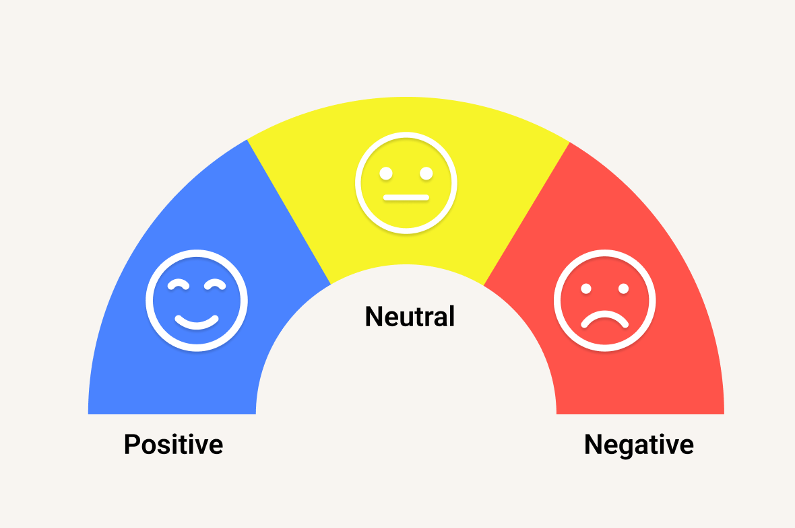
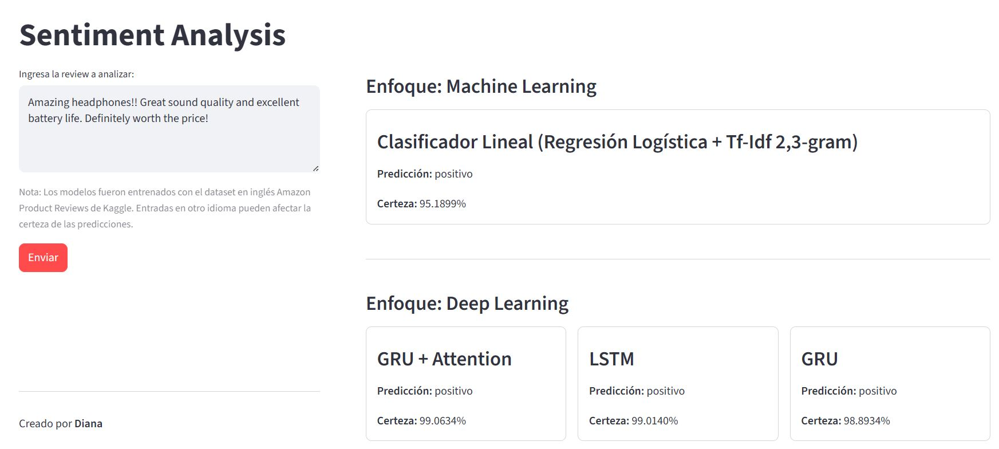
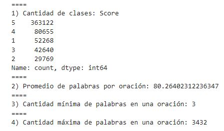
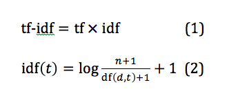
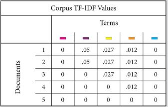
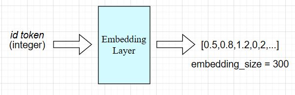

# SENTIMENT ANALYSIS FOR REVIEWS

<div align="center">
  
</div>

## 1) DESCRIPCIÓN
- Este proyecto contiene la evaluación de métodos de *Machine Learning (Logistic Regression, Tf-Idf)* y *Deep Learning (GRU, LSTM, Attention)* para la tarea de *Sentiment Analysis* en el dataset [*"Product Reviews Amazon"*](https://kaggle.com/datasets/arhamrumi/amazon-product-reviews) de la plataforma *Kaggle*. Dado que el *dataset* está en inglés, el pipeline de inferencia y la interfaz están optimizados para entradas en este idioma, ya que los modelos fueron entrenados con este conjunto de datos.

- Mediante el entrenamiento y prueba de los modelos, se analizó sus rendimientos en el conjunto de datos actual y se comparó la eficacia entre ellos, a través de métricas, en la clasificación de *reviews* (negativa, neutral o positiva).

- El entrenamiento y la evaluación de los modelos se realizaron en la plataforma *Kaggle* por la disponibilidad de GPU.
  
- Asimismo, se creó una interfaz de usuario que permite usar los modelos localmente y en tiempo real, para realizar predicciones.

----

### 1.1) IMAGEN DE LA INTERFAZ:

- A continuación, se muestra una imagen de la aplicación con una *review* de prueba para ver el funcionamiento de los modelos localmente y en tiempo real:

  <div align="center">
    
  </div>
  
----

## 2) PLANTEAMIENTO DEL PROBLEMA
En la actualidad, gran cantidad de información generada por los usuarios en redes sociales, reseñas y plataformas digitales se expresa en forma de texto no estructurado. Este tipo de datos contiene opiniones y percepciones que son valiosas, pero difíciles de analizar manualmente debido a su volumen.

El análisis de sentimientos (*Sentiment Analysis*) surge como una solución para procesar automáticamente estos textos y clasificar las opiniones en categorías como positivas, negativas o neutras. Esto permite transformar grandes volúmenes de texto en información útil para la toma de decisiones.

Por ello, este proyecto busca implementar y comparar distintos enfoques de *Machine Learning* y *Deep Learning* para la tarea de *Sentiment Analysis*, y evaluar su desempeño en la clasificación de *reviews* como negativas, neutras o positivas.

----

## 3) DATASET
#### 3.1) <ins>Reseña</ins>:
- El dataset utilizado para el entrenamiento de los modelos fue *Amazon Product Reviews* [link], disponible en Kaggle.

- Contiene más de 568k *reviews* en inglés de diferentes productos de Amazon, y su *Score* correspondiente que va de 1 a 5. Sin embargo, para fines de este proyecto, el *Score* fue mapeado a valores de 0 a 2; es decir, 3 clases:
  
  -  **0: negativo, 1: neutral, 2: positivo.**

<div align="center">
  
  | Clases | Mapeo | Etiqueta Final |
  |--------|-------|----------------|
  | 1-2    | 0     | Negativo       |
  | 3      | 1     | Neutral        |
  | 4-5    | 2     | Positivo       |
  
</div>

#### 3.2) <ins>Análisis Exploratorio de Datos (EDA)</ins>:
- Antes del preprocesamiento, se realizó un análisis exploratorio de datos (EDA, por sus siglas en inglés) con el objetivo de entender, estadísticamente, el conjunto de datos en base a la cantidad oraciones por longitud y cantidad de clases:

<p align="center">
    
</p>

<p align="center">
  <sub>Figura: (izquierda) Distribución de clases. (derecha) Distribución de longitud de textos.</sub>
</p>


--> **3.2.1) <ins>Figura 1 (Distribución de clase)</ins>**:
  De la figura 1 (gráfica roja), se evidencia que existe imbalance de clases respecto a la etiqueta 5.
  A continuación, se muestra el porcentaje de cada clase antes de realizar el mapeo de clases:

<div align="center">
  
  | Clases | Porcentaje |
  |--------|------------|
  | 1      | 9%         |
  | 2      | 5%         |
  | 3      | 7%         |
  | 4      | 14%        |
  | 5      | 63%        |
</div>
 
  * De lo anterior, se deduce que al realizar el mapeo de clases, existirá mayor predominancia de la "nueva" clase 2 (que combina la clase 5 de 63% de representatividad), por sobre las "nuevas" clases 0 y 1.
   
* Por este motivo, antes de entrenar los modelos, se aplicó la técnica **Class Weight**, que se encarga de penalizar más a los modelos, durante el entrenamiento, cuando se equivocan en clasificar las clases minoritarias para evitar sesgos sobre la clase predominante.


--> **3.2.2) <ins>Figura 2: (Distribución de longitud de textos)</ins>**:
- De la figura 2 (gráfica azul), se ve que hay mayor presencia de oraciones que tienen longitudes de 100 a 500 palabras. 

- Si bien se visualiza que existen oraciones con longitudes de rango [2000 - 35000], suelen ser, aproximadamente, menos de 20 oraciones.


--> **3.2.3) <ins>Resumen estadístico</ins>:**
- A manera de resumen, se muestra la síntesis estadística  del dataset:
<div align="center">
  
</div> 


--> **3.2.4) <ins>Oraciones con length >= 900:</ins>**
- En el conjunto de datos, 255 oraciones presentan una longitud mayor o igual que 900; de las cuales, se tiene la siguiente distribución de cantidad por *score* (clase):

<div align="center">

  | Score | Cantidad oraciones (length >=900) |
  |-------|-----------------------------------|
  | 1     | 28                                |
  | 2     | 24                                |
  | 3     | 20                                |
  | 4     | 45                                |
  | 5     | 138                               |
  
</div>

- Al ver la cantidad de oraciones (255), y dado que no afectan significativamente a las clases minoritarias, se removieron del *dataset*, quedando 568199 *reviews*.
  

----

## 4) PREPROCESAMIENTO

#### 4.1) <ins>Limpieza de texto</ins>:
- Al analizar las oraciones del conjunto de datos, presentaron símbolos que debían ser removidos, tales como html *tags*, dígitos, palabras repetidas, signos de puntuación, entre otros.

  Luego de evaluarlas, se procedió con la limpieza de texto (datos), que fueron las siguientes, en base al análisis anterior:

| Limpieza de texto                                                         | ML                            | DL                                                      |
|--------------------------------------------------------------------------|-------------------------------|---------------------------------------------------------|
| Conversión de mayúsculas a minúsculas                                    | Sí                            | Sí                                                      |
| Remover HTML Tags                                                        | Sí                            | Sí                                                      |
| Expandir contracciones de palabras                                       | Sí                            | Sí                                                      |
| Eliminar posesivos ('s)                                                  | Sí                            | Sí                                                      |
| Eliminar signos de puntuación                                            | Tokenizador Tf-Idf se encarga | Sí, solo se mantienen ! ? . ,                           |
| Eliminar caracteres diferentes de letras y números                       | Tokenizador Tf-Idf se encarga | Sí, solo se mantienen los signos de puntuación elegidos |
| Mantener dígitos                                                         | No                            | Se reemplaza por "NUM"                                  |
| Repeticiones de palabras (se mantienen, como máximo, 2 letras repetidas) | Sí                            | Sí                                                      |


#### 4.2) <ins>Stop words</ins>:
- Si bien se suelen remover las *stop words* (palabras "comunes") durante el preprocesamiento, en este caso se optó por un análisis previo para evitar eliminar *stop words* como "not", "very", "but", entre otros, que puedan cambiar el significado de la *review* y que son útiles para que los modelos realicen la clasificación.

  <ins>Enfoques</ins>:
  
  --> **Machine Learning**: Se mantuvieron las *stop words*, dado que el modelo de Regresión Logística + Tf-Idf presentó mejor rendimiento al conservarlas.

  --> **Deep Learning**: Se mantuvieron algunas *stop words* (no todas), para NO remover palabras que puedan cambiar el significado de la *review*.


#### 4.3) <ins>Tokenización</ins>:
- Luego de realizar la limpieza de texto, se dividen las oraciones en unidades más pequeñas (tokens), que posteriormente serán convertidas en datos numéricos que los modelos puedan entender.

  <ins>Enfoques</ins>:
  
  --> **Machine Learning**: En el modelo de Regresión Logística + Tf-Idf, se aplicó una tokenización a nivel de palabra (*word level tokenization*), considerando unigramas, bigramas y trigramas. De esta manera, cada "dimensión" de la matriz *sparse* (resultante de aplicar Tf-Idf) representa una palabra o grupo de palabras (unigramas, bigramas, trigramas) del vocabulario de la data destinada para entrenamiento.

  --> **Deep Learning**: En los modelos que utilizan *deep learning*, específicamente redes recurrentes y mecanismo de atención, se entrenó el tokenizador *SentencePiece* en la data de entrenamiento, especificando el tamaño del vocabulario en 8000. La tokenización NO es a nivel de palabras, sino a nivel de sub-palabras.

**NOTA**: Antes de utilizar el tokenizador, el conjunto de datos se dividió en 80% para entrenamiento, y 20% para validación y test. De esta manera, los tokenizadores utilizan únicamente la data de entrenamiento, evitando un posible *Data Leakage*.

----

## 5) FEATURE EXTRACTION
Luego de aplicar los tokenizadores, y que cada una de las oraciones se dividan en palabras, conjunto de palabras o sub-palabras (dependiendo del tipo de tokenizador usado) y, adicionalmente, en el caso de la tokenización en el enfoque de *Deep Learning*, se mapeen a un número entero (*id token*), deben convertirse a matrices o tensores que los modelos puedan entender.

#### 5.1) <ins>Tf-Idf (Machine Learning)</ins>:
  - Al aplicar el algoritmo Tf-Idf al texto preprocesado, el tokenizador establecido en su configuración fue a nivel de "palabra", considerando unigramas, bigramas y trigramas. En ese sentido, al utilizarlo en la data de entrenamiento, el resultado fue una matriz *sparse*, de m*n, donde las filas (m) representan los documentos (oraciones), y las columnas (n) representan las palabras/conjunto de palabras del vocabulario de la data de *train*.

<p align="center">
      
</p>

<p align="center">
  <sub>Figura: (izquierda) Fórmula Tf-Idf en Sklearn. (derecha) Matriz Sparse - Referencial.</sub>
</p>

  --> Los valores de la matriz indican la importancia o "peso" de una palabra o conjunto de palabras dentro de un documento (oración) en relación con una colección de documentos (total de oraciones de la data de entrenamiento).


#### 5.2) <ins>Embeddings (Deep Learning)</ins>:
  - Cada *id token* (número entero) se mapea a un vector de 300 dimensiones al pasar por la capa de *Embeddings*, que se aprende durante la etapa de entrenamiento de los modelos:

    --> integer value: embedding vector

    <div align="center">
      
    </div>
      
----

## 6) MODELOS COMPARADOS
Los modelos, con enfoques distintos *Machine Learning (ML)* y *Deep Learning (DL)*, que fueron entrenados en el conjunto de datos actual para su comparación, se muestran en la siguiente tabla:

<div align="center">
  
  | Enfoque | Modelo              | Representación de texto              | Class Weight |
|---------|---------------------|--------------------------------------|--------------|
| ML      | Logistic Regression | Tf-Idf (1-gram)                      | Sí           |
| ML      | Logistic Regression | Tf-Idf (1,2-gram)                    | Sí           |
| ML      | Logistic Regression | Tf-Idf (1,2,3-gram)                  | Sí           |
| ML      | Logistic Regression | Tf-Idf (2,3-gram)                    | Sí           |
| DL      | GRU+GlobalMaxPooling                 | Embeddings (sub-words SentencePiece) | Sí           |
| DL      | LSTM+GlobalMaxPooling                | Embeddings (sub-words SentencePiece) | Sí           |
| DL      | GRU+ATTENTION       | Embeddings (sub-words SentencePiece) | Sí           |

</div>

----

## 7) DISEÑO EXPERIMENTAL
Los enfoques utilizados fueron *Machine Learning (ML)* y *Deep Learning (DL)*.

- **Machine Learning (ML)**:
  - Se utilizó el algoritmo Tf-Idf para la conversión de texto a valores numéricos con diferentes representaciones (1,2,3-gram), para entrenarlos en modelos de regresión logística.

- **Deep Learning (DL)**:
  - Se entrenaron tres modelos secuenciales: GRU+GlobalMaxPooling, LSTM+GlobalMaxPooling y GRU+ATTENTION. Para garantizar una comparación justa entre arquitecturas, todos los modelos fueron entrenados utilizando la misma configuración de hiperparámetros.
  - A los modelos secuenciales se les aplicó *masking* manual, para evitar que realicen cálculos matemáticos sobre los valores del *padding* y sesguen los resultados.
  - Se utilizó la técnica *Early Stopping* durante el entrenamiento de los modelos para evitar el *overfitting*: si durante 5 épocas seguidas no hay mejora del *validation loss* (no disminución continua durante 5 veces) se detiene el entrenamiento, y se guarda el modelo de la época con menor *validation loss*.
  
    **NOTA:** Los hiperparámetros de los modelos fueron seleccionados tras varias iteraciones experimentales preliminares, con el objetivo de identificar una configuración que ofreciera un buen rendimiento general.

**IMPORTANTE**: En ambos enfoques se realizó la división de datos en 80% para entrenamiento, y 20% para validación y test.

----

## 8) MÉTRICAS DE EVALUACIÓN
Las métricas utilizadas fueron
  - Accuracy
  - F1 Score
  - Precision
  - Recall
    
  --> Adicionalmente, las tablas de comparación incluyen métricas específicas para la clase minoritaria (neutral, etiqueta 1). Esto permite evaluar con mayor detalle la capacidad de los modelos para identificar correctamente dicha clase, dado que los errores de clasificación tienden a concentrarse con mayor frecuencia en las categorías menos representadas.

----

## 9) COMPARACIÓN DE RESULTADOS

### <ins>Data de validación</ins>:

#### 9.1.1) <ins>Machine Learning (ML)</ins>:

| Enfoque | Modelo              | Representación de texto | Accuracy | F1 Score | Precision | Recall | <ins>Clase minoritaria (neutral: 1) Precision</ins> | <ins>Clase minoritaria (neutral: 1) Recall</ins> | <ins>Clase minoritaria (neutral: 1) F1 Score</ins> |
|---------|---------------------|-------------------------|----------|----------|-----------|--------|------------------------------------------|---------------------------------------|-----------------------------------------|
| ML      | Logistic Regression | Tf-Idf (1-gram)         | 0.822    |          | 0.658     | 0.770  | **0.32**                                     | **0.69**                                  | **0.44**                                    |
| ML      | Logistic Regression | Tf-Idf (1,2-gram)       | 0.898    | 0.788    | 0.756     | 0.835  | **0.50**                                     | **0.72**                                  | **0.59**                                    |
| ML      | Logistic Regression | Tf-Idf (1,2,3-gram)     | 0.904    | 0.798    | 0.769     | 0.839  | **0.53**                                     | **0.72**                                  | **0.61**                                    |
| ML      | Logistic Regression | Tf-Idf (2,3-gram)       | 0.906    | 0.799    | 0.774     | 0.832  | **0.55**                                     | **0.70**                                  | **0.61**                                    |

#### 9.1.2) <ins>Deep Learning (DL)</ins>:

| Enfoque | Modelo        | Representación de texto              | Accuracy | F1 Score | Precision | Recall | <ins>Clase minoritaria (neutral: 1) Precision</ins> | <ins>Clase minoritaria (neutral: 1) Recall</ins> | <ins>Clase minoritaria (neutral: 1) F1 Score</ins> |
|---------|---------------|--------------------------------------|----------|----------|-----------|--------|-----------------------------------------------------|--------------------------------------------------|----------------------------------------------------|
| DL      | GRU+GlobalMaxPooling           | Embeddings (sub-words SentencePiece) | 0.835    | 0.7003   | 0.665     | 0.772  | **0.35**                                                | **0.65**                                             | **0.45**                                               |
| DL      | LSTM+GlobalMaxPooling          | Embeddings (sub-words SentencePiece) | 0.839    | 0.706    | 0.668     | 0.779  | **0.37**                                                | **0.65**                                             | **0.47**                                               |
| DL      | GRU+ATTENTION | Embeddings (sub-words SentencePiece) | 0.849    | 0.716    | 0.683     | 0.783  | **0.36**                                                | **0.66**                                             | **0.47**                                               |


### <ins>Data de test</ins>:

#### 9.2.1) <ins>Machine Learning (ML)</ins>:

| Enfoque | Modelo              | Representación de texto | Accuracy | F1 Score | Precision | Recall | <ins>Clase minoritaria (neutral: 1) Precision</ins> | <ins>Clase minoritaria (neutral: 1) Recall</ins> | <ins>Clase minoritaria (neutral: 1) F1 Score</ins> |
|---------|---------------------|-------------------------|----------|----------|-----------|--------|------------------------------------------|---------------------------------------|-----------------------------------------|
| ML      | Logistic Regression | Tf-Idf (1-gram)         | 0.835    | 0.719    | 0.685     | 0.813  | **0.35**                                     | **0.79**                                  | **0.49**                                    |
| ML      | Logistic Regression | Tf-Idf (1,2-gram)       | 0.901    | 0.791    | 0.760     | 0.837  | **0.51**                                    | **0.73**                                  | **0.60**                                    |
| ML      | Logistic Regression | Tf-Idf (1,2,3-gram)     | x.xxx    | x.xxx    | x.xxx     | x.xxx  | **x.xxx**                                     | **x.xxx**                                  | **x.xxx**                                    |
| ML      | Logistic Regression | Tf-Idf (2,3-gram)       | 0.907    | 0.800    | 0.774     | 0.833  | **0.55**                                     | **0.70**                                  | **0.62**                                    |

#### 9.2.2) <ins>Deep Learning (DL)</ins>:

| Enfoque | Modelo        | Representación de texto              | Accuracy | F1 Score | Precision | Recall | <ins>Clase minoritaria (neutral: 1) Precision</ins> | <ins>Clase minoritaria (neutral: 1) Recall</ins> | <ins>Clase minoritaria (neutral: 1) F1 Score</ins> |
|---------|---------------|--------------------------------------|----------|----------|-----------|--------|-----------------------------------------------------|--------------------------------------------------|----------------------------------------------------|
| DL      | GRU+GlobalMaxPooling           | Embeddings (sub-words SentencePiece) | 0.857    | 0.747   | 0.835     | 0.706  | **0.79**                                                | **0.41**                                             | **0.54**                                               |
| DL      | LSTM+GlobalMaxPooling          | Embeddings (sub-words SentencePiece) | 0.862    | 0.757    | 0.848     | 0.711  | **0.80**                                                | **0.43**                                             | **0.56**                                               |
| DL      | GRU+ATTENTION | Embeddings (sub-words SentencePiece) | 0.868    | 0.754    | 0.833     | 0.717  | **0.77**                                                | **0.41**                                             | **0.53**                                               |


- **Precision alta + Recall bajo:**
  - **Precision alta**: Cuando el modelo predice que algo que pertenece a esa clase, casi siempre acierta.
  - **Recall bajo**: Se le escapan muchos casos reales de esa clase.

      --> La combinación de ambas métricas indica lo siguiente: "pocas predicciones para esa clase, pero muy seguras".

- **Precision baja + Recall alto:**
  - **Precision baja**: Cuando el modelo predice que algo pertenece a esa clase, se equivoca seguido (incluye muchos falsos postivos).
  - **Recall alto**: El modelo logra detectar la gran mayoría de los casos reales de esa clase.

    --> La combinación de ambas métricas indica lo siguiente: "predicciones masivas para esa clase, pero no tan fiables"
  
----

## 10) OBSERVACIONES - INSIGHTS:

- Los modelos Logistic Regression + Tf-Idf, cuando trabajan con unigramas, bigramas y trigramas a nivel de palabra. presentan un rendimiento superior al compararlos entre sí.
  
    **-->** Los unigramas, bigramas y trigramas ayudan a los modelos de *Machine Learning* a ver palabras conjuntas, y NO separadas, que podrían confundir a los modelos. Ello se evidencia en el salto de las métricas en la clase minoritaria entre los modelos de Logistic Regression + Tf-Idf considerando unigramas, bigramas y trigramas: [Ver tabla 1 ML Comparación Validación](#911-machine-learning-ml). [Ver tabla 2 ML Comparación Test](#921-machine-learning-ml)

- Los modelos, bajo el enfoque *Deep Learning**, presentaron rendimientos similares entre sí (incluido el modelo con mecanismo de atención).

- Al observar las métricas de evaluación en los modelos de *Machine Learning* respecto a la clase minoritaria (neutral), el "mejor" modelo (2-3,gram) presentó métricas de *precision*=0.55 y *recall*=0.70. El análisis de las matrices de confusión reveló una notable reducción en las clasificaciones erróneas de la clase neutral, mitigando el sesgo del modelo a polarizarlas incorrectamente hacia las clases positiva o negativa.

- El "mejor" modelo del enfoque *Deep Learning* (LSTM) respecto a la clase minoritaria (neutral), alcanza valores de *precision*=0.80 y *recall*=0.43, indicando que cuando predice la clase neutral, suele acerta, pero deja pasar una proporción importante de casos de dicha clase.


  --> **Logistic Regression (2-3,gram)**:
    - Encuentra la mayoría de los casos de la clase neutral y presenta un comportamiento más equilibrado en general, mostrando mayor capacidad de detección de dicha clase.
      
      **LSTM**:
    - Cuando predice una review como "neutral", suele acertar con alta precisión, pero no logra identificar una parte importante de los casos reales de esa clase, lo que indica una menor sensibilidad hacia la clase minoritaria.


- Los modelos de Logistic Regression con representación TF-IDF basada en bigramas y trigramas obtuvieron el mejor rendimiento global entre los modelos evaluados, superando a las arquitecturas secuenciales (GRU+GlobalMaxPooling, LSTM+GlobalMaxPooling) y al modelo con mecanismo de atención (GRU+Attention). Esto evidencia que, para la tarea y el conjunto de datos analizado, las representaciones basadas en n-gramas resultaron más efectivas que arquitecturas más complejas basadas en aprendizaje secuencial.

----

## 11) TRABAJO FUTURO:
- Se realizará el *fine tunning* de un modelo con arquitectura transformer para aplicar el mecanismo *self-attention* sobre cada token, y NO sobre cada hidden step, a diferencia de la atención utilizada en el modelo GRU actual.


----
----

## ESTRUCTURA DEL PROYECTO
```plaintext
  proyecto-root/
  │
  |--- architecture_models_dl (en PyTorch, archivos .py)/
  │
  |--- saved_models/
  │   |--- machine_learning/
  │   │    |-- (pesos del modelo y vectorizador de machine learning)
  │   │
  │   | deep_learning/
  │       |-- (pesos de modelos y tokenizador de deep learning)
  │
  |--- notebook/
  │   |--- (código de entrenamiento y evaluación)
  │
  |--- images/
  │   |--- (imágenes usadas en el README)
  │
  |--- approaches_models.py
  |--- utils.py
  |--- main.py
  |--- requirements.txt
  │
  |--- README.md
```

- **architecture_models_dl**:  
	- Archivos .py que contienen las arquitecturas de los modelos de DL para instanciación.

- **saved_models**:
  	- Archivo con los modelos guardados (formato joblib y pth), incluyendo el vectorizador Tf-Idf y el tokenizador *SentencePiece*.
  	- NOTA: Primero debe descargarse el archivo .zip y descomprimirlo, para almacenarlos en la carpeta.

- **approaches_models.py**:

  Contiene las clases que se encargan del preprocesamiento de texto y predicción para ambos enfoques:
	- Machine Learning: LogisticRegression + Tf-Idf 2,3-grams
	- Deep Learning: LSTM, GRU, Attention

- **utils.py**:
  	- Contiene funciones auxiliares para la carga de modelos y tokenizadores.

- **main.py**:
  	- Aplicación en Streamlit que contiene la interfaz para la prueba de los modelos de Machine Learning y Deep Learning.

- **requirements.txt**:
  	- Contiene las librerías necesarias para la ejecución de la aplicación.

----

## INSTALACIÓN Y EJECUCIÓN LOCAL
Para ejecutar el programa de forma local, sigue los pasos descritos:

**IMPORTANTE:**
- Primero, descargar el archivo ai_models.zip que se encuentra en el link del README.md dentro de 'models' y descomprimirlo.
- Posteriormente, copiar ambas carpetas ("deep_learning" y "machine learning") y almacenarlas en la carpeta 'saved_models' que se crea luego de clonar el repositorio.

### **Ubuntu**
- Clonar el repositorio (recomendado en el escritorio):
```bash
git clone (link_del_repo)
```
No te olvides de copiar los carpetas ("deep_learning" y "machine learning") (luego de descomprimir el zip descargado) y almacenarlos en la carpeta 'saved_models' que se creó al clonar el repositorio.
- Entrar a la carpeta donde clonaste el repositorio:
```bash
cd [Ruta_donde_clonaste_el_repositorio]
```
- Crear el environment (en esa misma carpeta):
```bash
python3 -m venv sentiment-analysis-env
```
- Activar el environment:
```bash
source sentiment-analysis-env/bin/activate
```
- Instalar las librerías necesarias:
```bash
pip install -r requirements.txt
``` 
- Ejecutar la aplicación:
```bash
streamlit run main.py
``` 

### **Windows**
- Clonar el repositorio (recomendado en el escritorio):
```bash
git clone (link_del_repo)
```
No te olvides de copiar las carpetas ("deep_learning" y "machine_learning) (luego de descomprimir el zip descargado) y almacenarlas en la carpeta 'saved_models' que se creó al clonar el repositorio.
- Entrar a la carpeta donde clonaste el repositorio:
```bash
cd [Ruta_donde_clonaste_el_repositorio]
```
- Crear el environment (en esa misma carpeta):
```bash
python -m venv sentiment-analysis-env
```
- Activar el environment:
```bash
.\sentiment-analysis-env\Scripts\activate
```
- Instalar las librerías necesarias:
```bash
pip install -r requirements.txt
``` 
- Ejecutar la aplicación:
```bash
streamlit run main.py
```

**Nota:** La primera vez de ejecución, tardará unos segundos realizar la predicción, debido a que se deben cargar los modelos; sin embargo, una vez que termina la carga, la predicción es instantánea.
